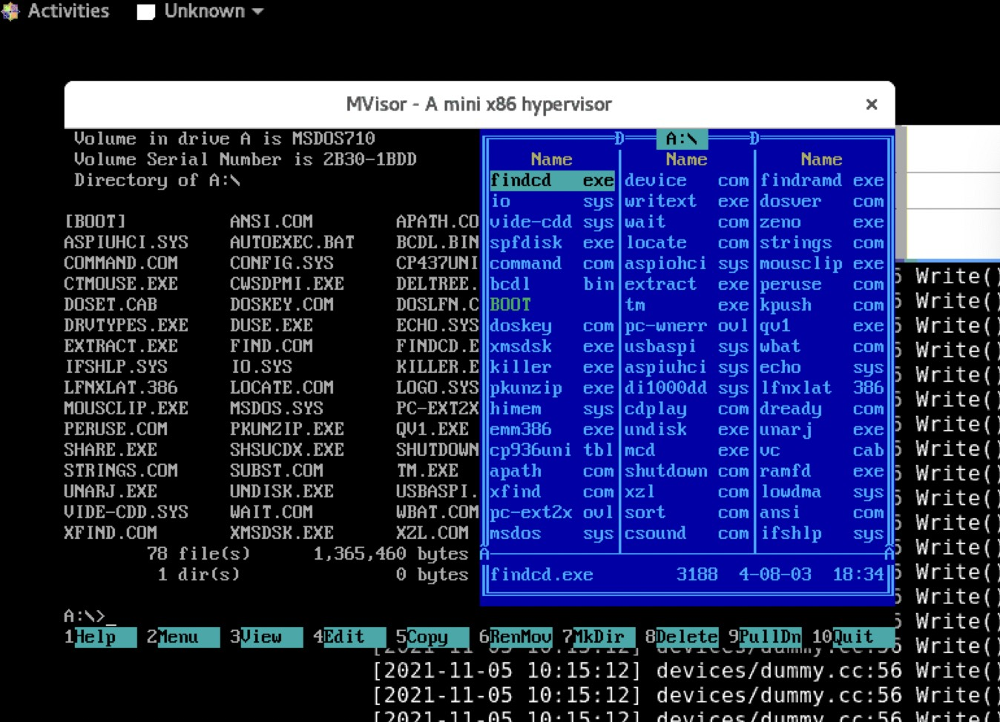

# MVisor: A mini x86 hypervisor

## Goal

1. A minimal hypervisor based on KVM and x86 (replace QEMU)
2. A limited number of emulated devices (support plugins in later version)
3. Linux and Windows as guest VMs
4. VFIO (espectially vGPU) and migration
5. Extremely stable and high performance

## Roadmap And Current Status

Milestone 1: Boot OS
Nov 2021

1. Multi VCPU ✅
2. Load SeaBIOS ✅
3. Memory Region Management ✅
4. IOPort Management ✅
5. Devices Management ✅
6. RTC(CMOS) ✅
7. PS/2 ✅
8. PCI ISA ICH9-LPC (Working)
9. QEMU CFG (Working) // Needs ACPI Tables
10. DMA (ISA DMA)
11. IDE / ATA / VirtIO (Floppy CDROM)
12. Parallel Port ❌
13. Serial Port ❌
14. VGA / QXL (Text VGA)
15. Option Roms / SMBIOS / ACPI Table
16. Boot DOS ✅
17. Boot OS (Windows 7 or 10) 
18. QCOW2

Milestone 2: Multimedia & Networking
Dec 2021
...

Milestone 3: Migration
Jan 2022
...

Milestone 4: Virtualization Management
Feb 2022
...

## Install

Install gcc and c++, then simply type `make`.

## Screenshot

