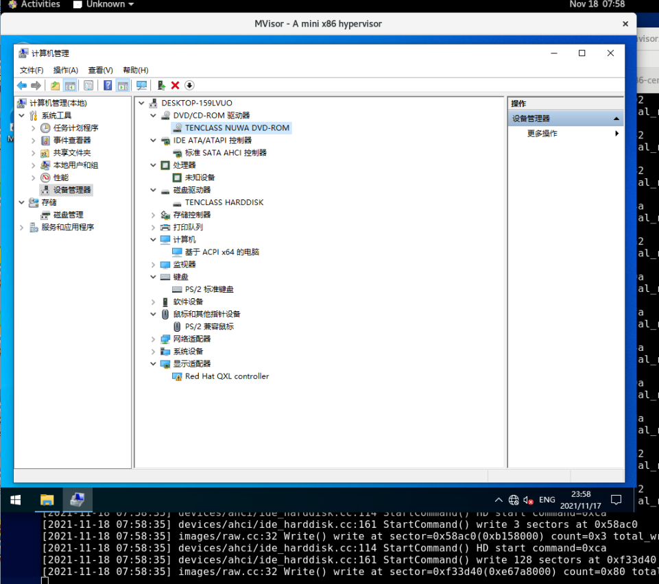
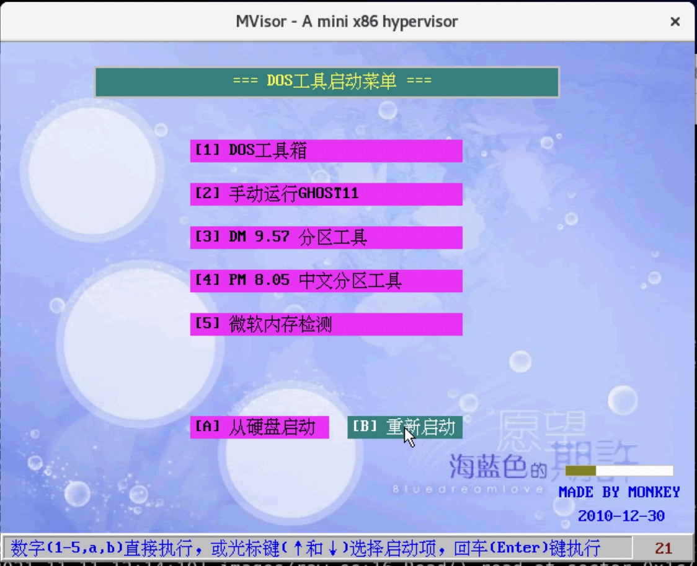

# MVisor: A mini x86 hypervisor

## Goal

1. A minimal hypervisor based on KVM and x86 (replace QEMU)
2. A limited number of emulated devices (support plugins in later version)
3. Linux and Windows as guest VMs
4. VFIO (espectially vGPU) and migration
5. Extremely stable and high performance

## Roadmap And Current Status

Milestone 1: Boot OS
Nov 2021

1. Multi VCPU ✅
2. Load SeaBIOS ✅
3. Memory Region Management ✅
4. IOPort Management ✅
5. Devices Management ✅
6. RTC(CMOS) ✅
7. PS/2 ✅
8. PCI ISA ICH9-LPC ✅
9. QEMU CFG ✅
10. DMA ❌
11. IDE ❌ / AHCI ✅
12. Parallel Port ❌
13. Serial Port ❌
14. VGA / VBE ✅
15. Option Roms / SMBIOS / ACPI Table ✅
16. Boot DOS ✅
17. Boot OS (Windows 8 or 10) ✅
18. QCOW2 ✅

Milestone 2: Multimedia & Networking
Dec 2021

1. VirtIO (Console✅ / Block (developing) / Net / Balloon)
2. SpiceAgent ✅
3. QemuGuestAgent
4. Qxl ✅
5. Audio (ICH9-HDA)
6. Tap network
7. User network
8. SfAgent
9. VFIO
10. WebDAV

Milestone 3: Migration
Jan 2022
...

Milestone 4: Virtualization Management
Feb 2022
...

## Install

For CentOS 8, install libaio-devel, SDL-devel, gcc-c++.

Then type `make`.

An ISO image file is needed to install OS. Change the file path in machine.cc

## Screenshot

