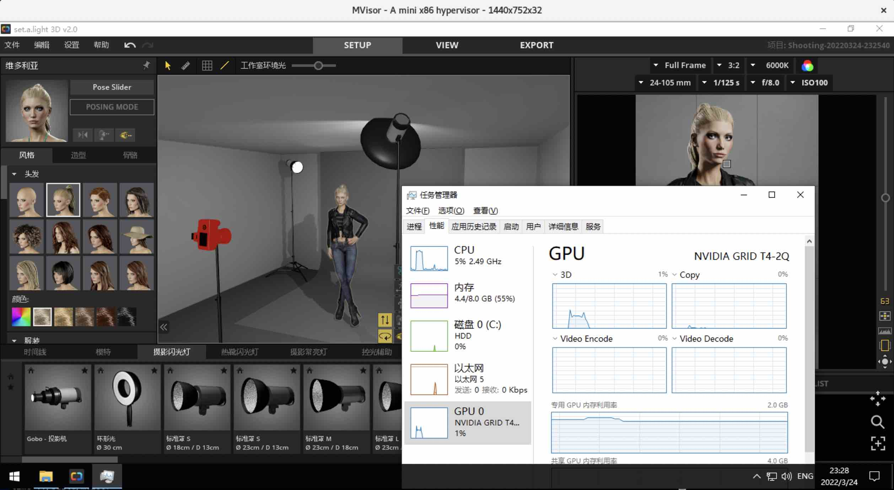
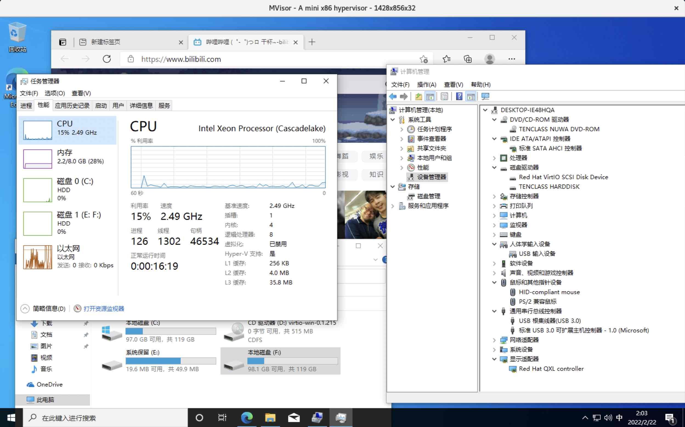

# MVisor: A mini x86 hypervisor

## Goal

1. A minimal hypervisor based on KVM and x86 (replace QEMU)
2. A limited number of emulated devices (support plugins in later version)
3. Linux and Windows as guest VMs
4. VFIO (especially vGPU) and migration
5. Extremely stable and high performance


## Screenshot

### Ubuntu


### vGPU



### Multimedia




## Roadmap And Current Status

What's supported now:

### Basic functions

1. 440FX ✅ / Q35 Chipset ✅
2. SeaBIOS ✅
3. Memory Region Management ✅
4. IOPort Management ✅
5. Devices Management ✅
6. RTC (CMOS) ✅
7. PS/2 ✅
8. PCI ISA ICH9-LPC ✅
9. QEMU CFG ✅
10. Legacy DMA ✅
11. IDE ✅ / AHCI ✅
12. Floppy Disk ✅
13. Serial Port ✅
14. VGA / VBE ✅
15. Option Roms ✅ / SMBIOS ✅ / ACPI Table ✅
16. Boot DOS ✅
17. Boot OS (Win98 to Win11 / DOS / Ubuntu) ✅
18. QCOW2 ✅

### Multimedia & Networking

1. Virtio (Console ✅ / Block ✅ / Net ✅ / VirtioFS ✅ / VGPU ✅ / CUDA ✅ / Balloon)
2. SpiceAgent ✅
3. QemuGuestAgent ✅
4. Qxl ✅
5. Audio (ICH9-HDA / AC97) ✅
6. Tap network
7. User network ✅
8. VFIO (mdev & passthrough) ✅
9. Samba
10. USB 1.0 UHCI ✅ / USB 3.0 XHCI ✅ / USB Tablet ✅ / USB Midi ✅ / USB Wacom ✅

### Hyper-V & Migration

1. CPU migration ✅
2. VFIO migration ✅
3. Migration to sparse files ✅
4. Hyper-V enlightenments ✅


## Compile & Run

For RockyLinux 9.3,

```
dnf install epel-release gdb
dnf --enablerepo=devel install -y gcc-c++ glib2-devel pixman-devel SDL2-devel yaml-cpp-devel libuuid-devel protobuf-devel protobuf-compiler libzstd-devel zlib-devel alsa-lib-devel libjpeg-devel opus-devel

meson setup build
meson compile -C build

./build/mvisor -c config/sample.yaml
```

An ISO image file is needed to install OS. Modify config/default.yaml to configure image path.

Virtio is recommended:

<a href="https://fedorapeople.org/groups/virt/virtio-win/direct-downloads/stable-virtio/virtio-win.iso">Download Virtio Guest Tools</a>
